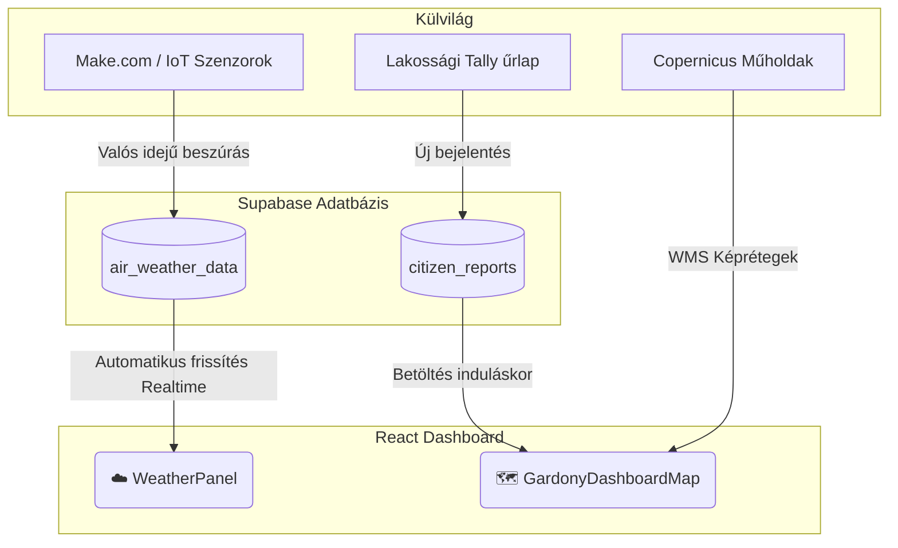

# 🌳 Gárdony Környezeti Dashboard - Projekt Állapot

Ez a dokumentum összefoglalja, hogy jelenleg hol tartunk, melyik modul mit csinál, és hogyan épül fel a felület.

## 📐 Vizuális Elrendezés Térkép

Az alábbi ábra (táblázat) mutatja a képernyő felosztását.  
A **zöld pipával (✅)** jelölt részek már élő kódként futnak és be vannak kötve az adatbázisba/térképbe, míg a **sárga homokórával (⏳)** jelölt részek még csak statikus "helykitöltők" (szövegek dobozokban), amik várják, hogy programozzuk őket.

| ⚙️ FEJLÉC (Gárdony Környezeti Dashboard - Fő KPI mutatók) ✅ (Statikus, de végleges) |
| :--- |

| ☁️ METEOROLÓGIA ✅ | 🗺️ INTERAKTÍV TÉRKÉP ✅ | 🗑️ HULLADÉK ⏳ |
| :--- | :--- | :--- |
| **Élő adatbázis kapcsolat** Honnan: `Supabase` Tábla: `air_weather_data`  *Mit látsz:* Hőmérséklet, Pára, Szél (Folyamatosan frissül) | **Élő Térkép** Alap: `OpenStreetMap` Műhold: `Copernicus WMS 1 & 2` Pöttyök: `Supabase` -> `citizen_reports`  *Mit látsz:* Nagyítós, mozgatható térkép a bejelentésekkel. | **Helykitöltő** Ide jöhetnek a kukák töltöttségi adatai.  *Jelenleg:* Sima statikus narancssárga doboz. |
| *(Ez a doboz leér egészen idáig)* | 🌊 VÍZMINŐSÉG TRENDEK ⏳ | 💨 LEVEGŐMINŐSÉG & ZÖLDFELÜLET ⏳ | ⚠️ AI RIASZTÁSOK ⏳ |
|  | **Helykitöltő** Ide jöhetnek a bóják adatai (vonaldiagramok).  *Jelenleg:* Sima statikus zöld doboz. | **Helykitöltő** Ide jöhet a PM2.5 / PM10 diagram.  *Jelenleg:* Sima statikus lila doboz. | **Helykitöltő** Ide jöhet a szöveges anomália detektor.  *Jelenleg:* Sima statikus piros doboz. |

---

## 🔗 Adatkapcsolatok (Folyamatábra)

Így áramlanak jelenleg az adatok a rendszeredben:

## 🛰️ Copernicus Műholdas Rétegek Konfigurációja

Az alábbi táblázat összefoglalja a térkép modulhoz kapcsolt Copernicus rétegeket:

| Réteg Neve (UI) | Copernicus Layer ID | Endpoint / Instance ID | Megjegyzés |
| :--- | :--- | :--- | :--- |
| **Zavarosság (NDWI)** | `1_TRUE_COLOR` | `e28f1a16-eeae-472b-b095-39a50537ba6c` | Alga1 rétegként is hivatkozva a gyökérben |
| **Sentinel-2 Algásodási Hőtérkép (NDCI)** | `2_TRUE_COLOR` | `841fca04-e199-424a-b6f7-86d4aa23b911` | Alga2 rétegként is hivatkozva a gyökérben |
| **Hőtérkép (LST)** | `LST_HOTERKEP` | `5d044f7a-d7a1-4fb2-aeef-c5b6181e121c` | **[ÚJ]** Felszíni hőmérséklet hőtérkép |
| **Beépítettség (NDBI)** | `NDBI_BEEPITETTSEG` | `5d044f7a-d7a1-4fb2-aeef-c5b6181e121c` | **[ÚJ]** Városi / beépített területek indexe |
| **Zöldterület (NDVI)** | `NDVI_ZOLDTERULET` | `5d044f7a-d7a1-4fb2-aeef-c5b6181e121c` | **[ÚJ]** Vegetáció sűrűség és egészség |
| **Légszennyezettség (NO₂)** | `NO2_LEGSZENNYEZES` | `5d044f7a-d7a1-4fb2-aeef-c5b6181e121c` | **[ÚJ]** Nitrogén-dioxid koncentráció |

A rétegek a térkép jobb felső sarkában lévő **rétegválasztó (Layers Control)** menüből egyszerűen ki- és bekapcsolhatóak. Minden rétegnél a felhőlefedettségi küszöbérték `maxcc={20}`-ra van állítva a tiszta látvány érdekében, a `transparent={true}` és `format="image/png"` beállítások pedig biztosítják az OpenStreetMap alaptérkép feletti rétegződést.

